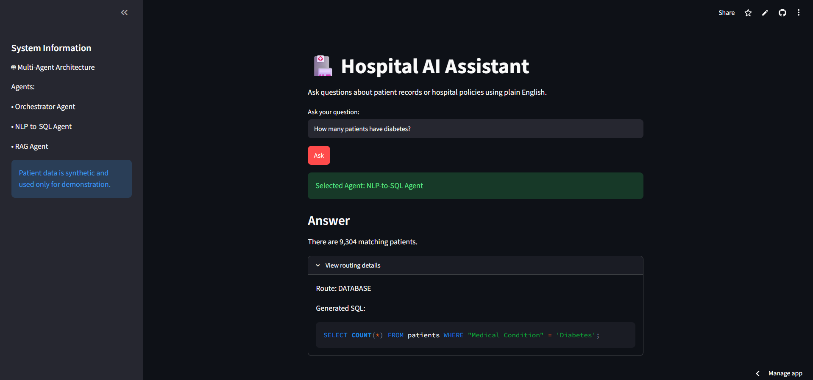
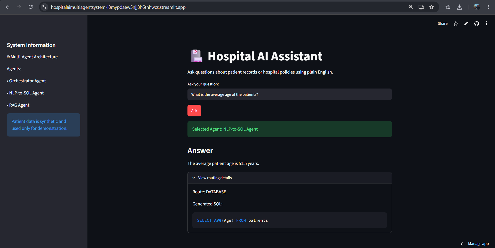
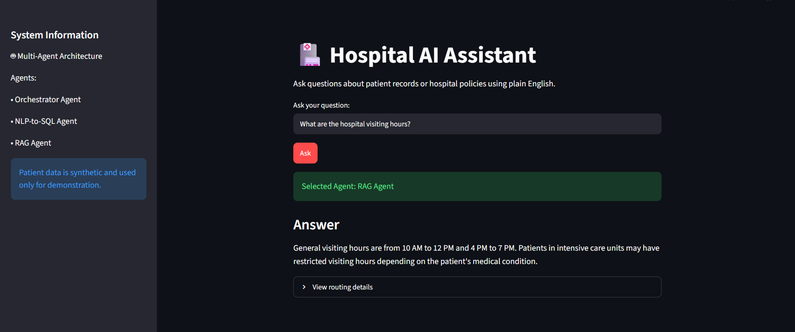
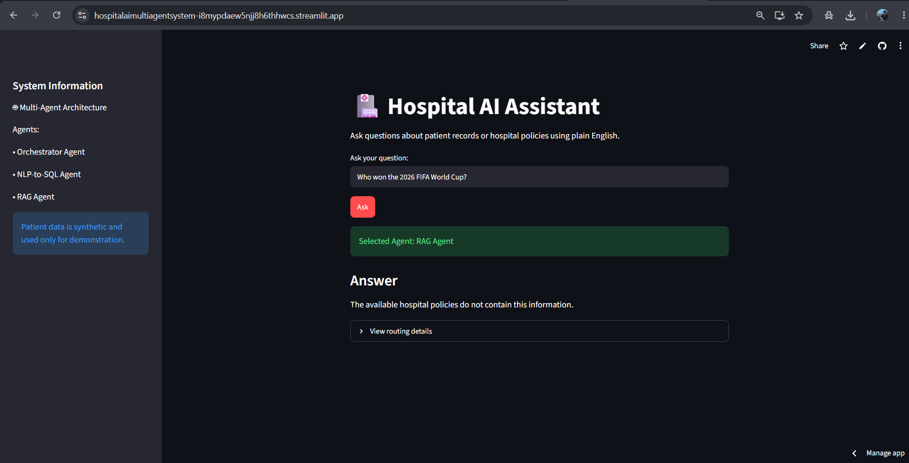

# 🏥 Hospital AI Assistant

An AI-powered multi-agent application that allows hospital staff to query synthetic patient records and hospital policy documents using plain English.

## 🚀 Project Overview

The system uses an Orchestrator Agent to classify incoming questions and automatically route them to the appropriate specialized agent.

- **NLP-to-SQL Agent** → answers questions about structured patient data.
- **RAG Agent** → retrieves information from hospital policy documents.
- **Orchestrator Agent** → decides which agent should handle each question.

The application provides a single conversational interface through Streamlit.

🚀 Live Demo  https://hospitalaimultiagentsystem-i8mypdaew5njj8h6thhwcs.streamlit.app/

## 🏗️ Architecture
```text


                    User
                     |
                     v
             Orchestrator Agent
                /           \
               /             \
              v               v
      NLP-to-SQL Agent     RAG Agent
              |               |
              v               v
           SQLite           FAISS
              |               |
              v               v
       Patient Records    Policy Documents
               \             /
                \           /
                 v         v
                  Gemini
                     |
                     v
                Final Answer

```

🚀 Live Demo  https://hospitalaimultiagentsystem-i8mypdaew5njj8h6thhwcs.streamlit.app/

## 📸 Project Screenshots

### NLP-to-SQL Agent



### Database Query



### RAG Agent



### Out-of-Scope Query


